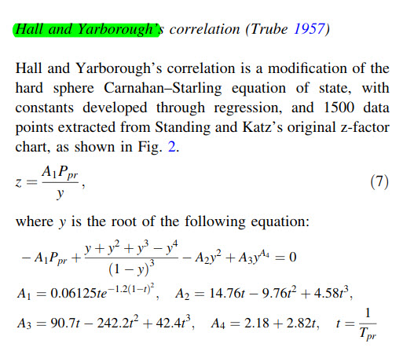
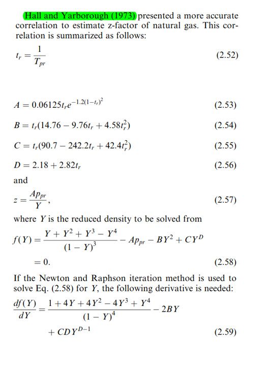
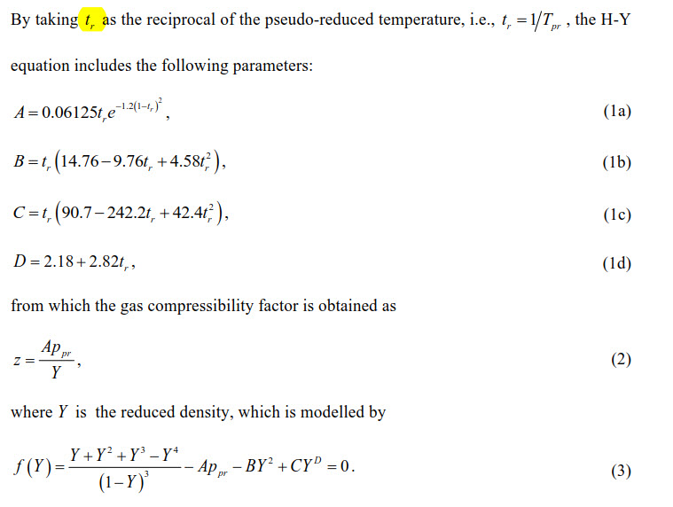
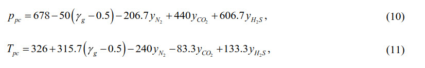

```{r setup, include=FALSE}
knitr::opts_chunk$set(echo = TRUE)
```


## From paper by Kareem, Iwalezawa and Al-Marhoun
Link: https://www.dropbox.com/s/xiaijtokwsu5ykt/JPT%206481%E2%80%93492%20New%20explicit%20correlation%20for%20the%20compressibility%20factor%20of%20natural%20gas%20%5B5star%20petroleum%20zfactor%5D.pdf?dl=0





## From book Guo, Lyons, Galambor, Petroleum Production Eng.




## From paper by Fatoorehchi, Abolghasemi, Rach and Assar
https://www.dropbox.com/s/3982pt63hi32p6c/10.1002%20cjce.22054%20-%20fatoorehchi2014.pdf?dl=0




### Example 1
Temperature = 366.5 K \
Pressure = 13.7895 MPa \
Gas specific gravity = 0.7 \
yN2 = 0.05 \
yCO2 = 0.05 \
yH2S = 0.02 \


```{r}
library(rNodal)

# Example 1 in Fantoorechi paper
temp.F <-  200
pres.a <- 2000

print(z.hallyarborough(pres.a = 2000, temp.f = 200, gas.sg = 0.7,
                       n2.frac = 0.05, co2.frac = 0.05, h2s.frac = 0.02))
```

Using equation for impurities in gas:



From the paper, $z(NR) = 0.8362$.


```{r}
print(rNodal:::z.hallyarboroughL(pres.a = 2000, temp.f = 200, gas.sg = 0.7,
                       n2.frac = 0.05, co2.frac = 0.05, h2s.frac = 0.02))
```

```{r}
gas.sg <- 0.7
n2.frac = 0.05
co2.frac = 0.05
h2s.frac = 0.02

temp.pc <- 326 + 315.7 * (gas.sg - 0.5) - 240 * n2.frac -
              83.3 * co2.frac + 133.3 * h2s.frac
print(temp.pc)
# 375.61 R = 208.6894 K
```


```{r}
# from Fatorechi paper:
# Table 1, Example 1 solution
pres.pc.M <- 4.7697  # Mpa

# All temperatures in Kelvin
temp.K    <- 366.5   # Kelvin
temp.pc.K <- 208.6   # Kelvin
temp.r <-  temp.pc.K / temp.K
print(temp.r)
```


```{r}
# All temperatures in Rankine
temp.R <- temp.F + 460
temp.r <- temp.pc / temp.R
print(temp.r)
```


```{r}
# from the solution in Example 1, Fatoorechi
temp.pc.K <- 208.6 # Kelvin
temp.r    <- 0.617678
temp.K <-  temp.pc.K / temp.r
print(temp.K)
```


## Example 2 from Fatoorechi paper

Temperature = 355.4 K = 180 F\
Pressure = 34.4747 MPa = 5000 psi\
Gas specific gravity = 0.65 \
yN2 = 0.1 \
yCO2 = 0.08 \
yH2S = 0.02 \


```{r}
library(rNodal)

# Example 2 in Fantoorechi paper

print(z.hallyarborough(pres.a = 5000, temp.f = 180, gas.sg = 0.65,
                       n2.frac = 0.1, co2.frac = 0.08, h2s.frac = 0.02))
```


```{r}
# From the paper 
z.paper <- 1.0002 
```


## Example 3 from Fatoorechi paper

Temperature = 310.9 K = 100 F\
Pressure = 6.8947 MPa = 1000 psi\
Gas specific gravity =  \
Tpc = 237.2 K  = -32.71 F = 427.29 R\
Ppc = 4.4815 MPa = 650 psia \

```{r}
print(rNodal:::z.hallyarboroughL(pres.a = 1000, temp.f = 100, gas.sg = 0.82))
# z = 0.760227
# from paper, z = 0.7557
```

```{r}
# making a change in the z.hallyarboroughL function to take additional parameters
# pres.pc, temp.pc, pres.pr, temp.pr
z.hallyarboroughL <- function(pres.a, temp.f, gas.sg, pres.pc, temp.pc,
                              pres.pr, temp.pr,
                            n2.frac = 0, co2.frac = 0, h2s.frac = 0, ...) 
{
        funcY <- function(y) {
        # implicit equation
        # in some literature A = A1, B = A2, C = A3, D = A4

      - A * pres.pr + (y + y^2 + y^3 - y^4) / (1 - y)^3  - B * y^2 + C * y^D
        }
        
    if (missing(gas.sg)) {
        print("No gas.sg supplied.")
        if (missing(pres.pc) || missing(temp.pc)) {
            if (missing(pres.pr) || missing(temp.pr)) stop()
            # providing pres.pr and temp.pr
            print("using pres.pr and temp.pr")
            temp.r <- 1 / temp.pr
            # calculate pseudo-reduced
            pres.pc <- pres.a / pres.pr
            temp.pc <- (temp.f + 460) / temp.pr  # worksheet has bug in the Farenheit add
        } else {
            if (missing(pres.pc) || missing(temp.pc)) stop()
            print("Using Ppc and Tpc")
            crit <- calcGasPseudoReduced(pres.a, pres.pc, temp.f, temp.pc)
            pres.pr <- crit$pres.pr
            temp.pr <- crit$temp.pr
            temp.r  <- crit$temp.r
        }
    } else {
        print("gas.sg has been provided")
        crit <- calcCriticals(pres.a, temp.f, gas.sg,
                                        co2.frac = 0, h2s.frac = 0, n2.frac = 0)
        pres.pr <- crit$pres.pr
        temp.pr <- crit$temp.pr
        temp.r  <- crit$temp.r
        pres.pc <- crit$pres.pc
        temp.pc <- crit$temp.pc
    }
    # return(res)
        # pres.a = absolute pressure, psia
    # temp.f  = temperature, deg F

    # calculate pseudo-critical pressure and temperature
    # get pseudo-reduced
    # crit <- calcCriticals(pres.a, temp.f, gas.sg, co2.frac, h2s.frac, n2.frac, ...)


    t <- temp.r   # make it easier to read in the equation below

    A <- 0.06125 * t * exp(-1.2 * (1 - t)^2)
    B <- t * (14.76 - 9.76 * t + 4.58 * t^2)
    C <- t * (90.7 - 242.2 * t + 42.4 * t^2)
    D <- 2.18 + 2.82 * t

    All <- rootSolve::uniroot.all(funcY, c(-5.01, 5.99)) # find the root of the equation
    Y <- min(All)                         # minimum value
    z <- A * pres.pr / Y                  # calculate z
    zfactors <- named.list(z, Y, A, B, C, D,
                           pres.pr, temp.pr, pres.pc, temp.pc, temp.r)
    return(zfactors)
}

# supplying gas.sg
with_gas.sg <- c(method = "use_gas.sg", z.hallyarboroughL(pres.a = 1000, temp.f = 100, gas.sg = 0.82))
# z = 0.760227
# pres.pc = 662
# temp.pc = 427.024

# no gas.sg provided
with_pseudo_crit <- c(method = "use_pseudo_critical", z.hallyarboroughL(pres.a = 1000, temp.f = 100,  pres.pc = 662, temp.pc = 427))
names(with_pseudo_crit)

# no gas.sg provided
with_pseudo_red <- c(method = "use_pseudo_reduced", z.hallyarboroughL(pres.a = 1000, temp.f = 100,  pres.pr = 1.51, temp.pr = 1.31))
names(with_pseudo_red)

df <- data.frame(stringsAsFactors = FALSE)
df <- rbind(df, with_gas.sg, with_pseudo_crit, with_pseudo_red)

```


```{r}
calcCriticals <- function(pres.a, temp.f, gas.sg,
                          co2.frac = 0, h2s.frac = 0, n2.frac = 0,
                          correction = "")
{
    # pseudocritical temperatures in Ranine

    if (correction == "Brown") {
        brown <- calcGasCriticals.Brown(pres.a, temp.f, gas.sg,
                                        co2.frac = 0, h2s.frac = 0, n2.frac = 0)
        pres.pc <- brown$pres.pc
        temp.pc <- brown$temp.pc
    } else {
        # if (h2s.frac < 0.03 & n2.frac < 0.05) {
        if (h2s.frac > 0.3 & n2.frac > 0.05) {
            # calculate pseudo-criticals.
            # Guo pg 2/22
            # cat("\nsmall H2S and N2\n")
            # Valid for H2S < 3%; N2 < 5% and inorganic < 7%
            pres.pc <- 709.604 - 58.718 * gas.sg      # Eq 2.22
            temp.pc <- 170.491 + 307.344 * gas.sg     # Eq 2.23
        } else {
            # print("Guo 2/23")
            # Pseudo-criticals for impurity corrections
            # Ahmed, Guo pg 2/23
            pres.pc <- 678 - 50 * (gas.sg - 0.5) - 206.7 * n2.frac +
              440 * co2.frac + 606.7 * h2s.frac
            temp.pc <- 326 + 315.7 * (gas.sg - 0.5) - 240 * n2.frac -
              83.3 * co2.frac + 133.3 * h2s.frac
        }
    }

    pr <- calcGasPseudoReduced(pres.a, pres.pc, temp.f, temp.pc)
    pres.pr <- pr$pres.pr
    temp.pr <- pr$temp.pr
    temp.r  <- pr$temp.r

    criticals <- list(pres.pr = pres.pr,
                    temp.pr = temp.pr,
                    temp.r = temp.r,
                    pres.pc = pres.pc,
                    temp.pc = temp.pc)
    return(criticals)
}


calcGasPseudoReduced <- function(pres.a, pres.pc, temp.f, temp.pc) {
    # calculate pseudo-reduced
    pres.pr <- pres.a / pres.pc
    temp.pr <- (temp.f + 460) / temp.pc  # worksheet has bug in the Farenheit add
    temp.r <- 1 / temp.pr                # wrong division in worksheet cell c15
    return(named.list(pres.pr, temp.pr, temp.r))
}

named.list <- function(...) {
    nl <- setNames( list(...) , as.character( match.call()[-1]) )
    # nl <- setNames( list(...) , as.character( match.call()[-1]) )
    nl
}
```


```{r}
fMulti <- function(a, b, c, d) {
    if (missing(d)) {
        d <- 1
        e <- a * b *c
        print(match.call())
    }
    return(e)
}

fMulti(1,2,3)
```


