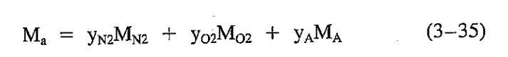

```{r setup, include=FALSE}
knitr::opts_chunk$set(echo = TRUE)
```

## Example 3-4
Calculate the aparent molecular weight of air given the components and mole fraction of each.

```{r}
load(file = "../data/mc-ch3.rda")
```


## Example 3-5
Calculate the specific gravity of a gas of the following composition:

```{r}
load(file = "../data/mc-ch3.rda")
```

### Calculate the aparent molecular weight




Using equation 3-35.

```{r}
names(ex35)
ex35["Ma"] <- ex35["mole_fraction"] * ex35["molecular_weight"]
M.a <- sum(ex35["Ma"])
```

```{r}
M.air <- 29
gas.sg <- M.a / M.air
print(gas.sg)
```

